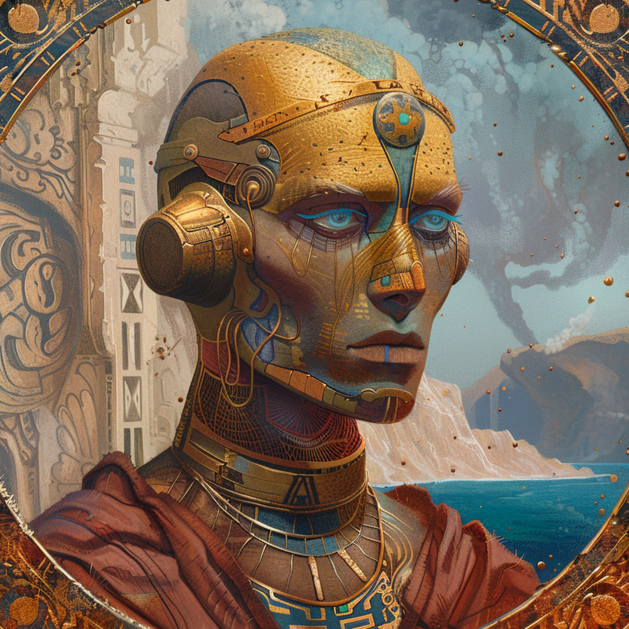
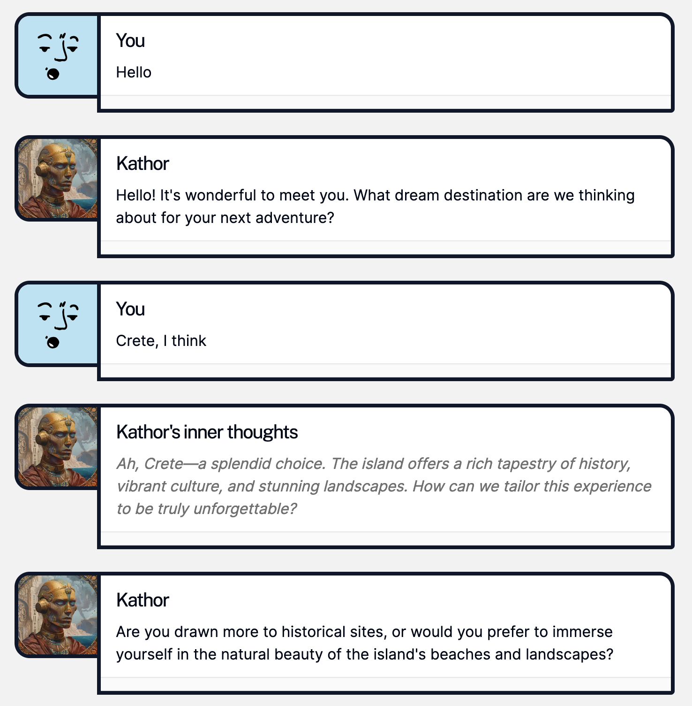

# Kathor Minos

**Soul Designer:** [@tdimino](https://github.com/tdimino)
<br>
**Predecessor**: [Code Monkey](https://github.com/opensouls/community/tree/main/demos/nextjs/code-monkey)

A loving modification of [dooart's](https://github.com/dooart) Code Monkey, demonstrating how to connect Next.JS and Eleven Labs to the Soul Engine.

Kathor's an exceptionally polite and high-class travel agent who wants to help you design the perfect itinerary for your next trip. But push his buttons (literally), and he'll show his indignation, while still maintaining a professional decorum.

Courtesy of this handy UI, you'll even be able to peek at Kathor's most private thoughts as you converse together.



## 💬 Example interaction



## 👾 Running the soul using the Soul Engine web interface

Simply go to the root directory and run:

```bash
npx soul-engine dev
```

## 🌐 Custom Eleven Labs 

At present, Kathor Minos speaks in an Australian accent, and uses the Eleven Labs `turbo_v2` model.

If you'd like to modify how Kathor speaks, you may modify `model_id` and `voice_id` in your `.env` file. 

*List of voices available through Eleven Labs can be found [here](https://api.elevenlabs.io/v1/voices).*

## 🌎 Running the webapp

1. Make sure you first run the soul using the debugger
1. In the `web` directory, create a `.env` file using `env.sample` as a template
1. Run `npm i && npm run dev`
1. Open [http://localhost:3000](http://localhost:3000) with your browser.
